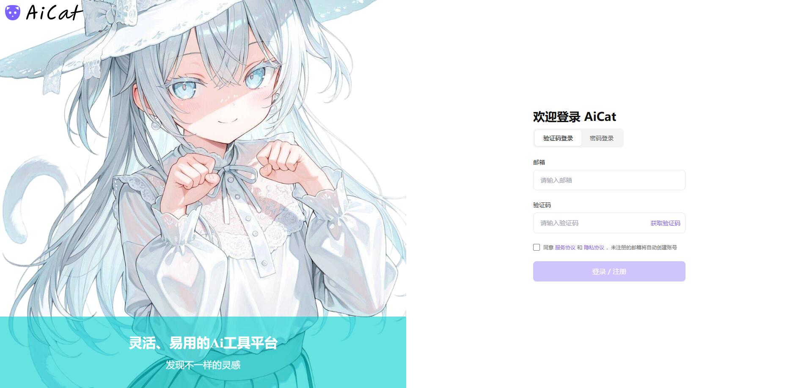
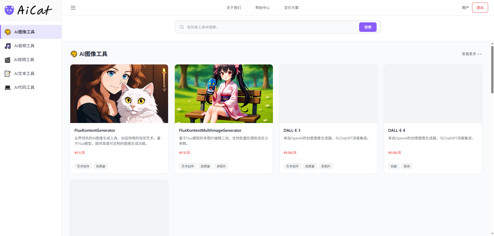
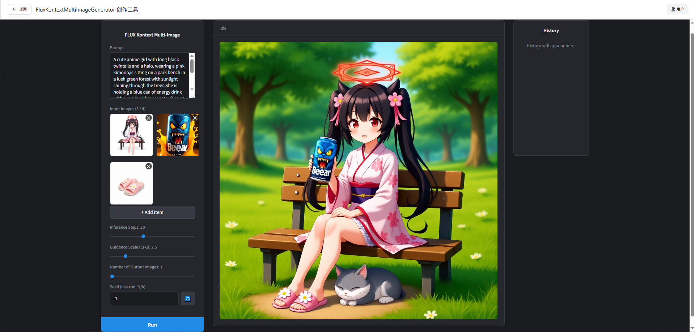
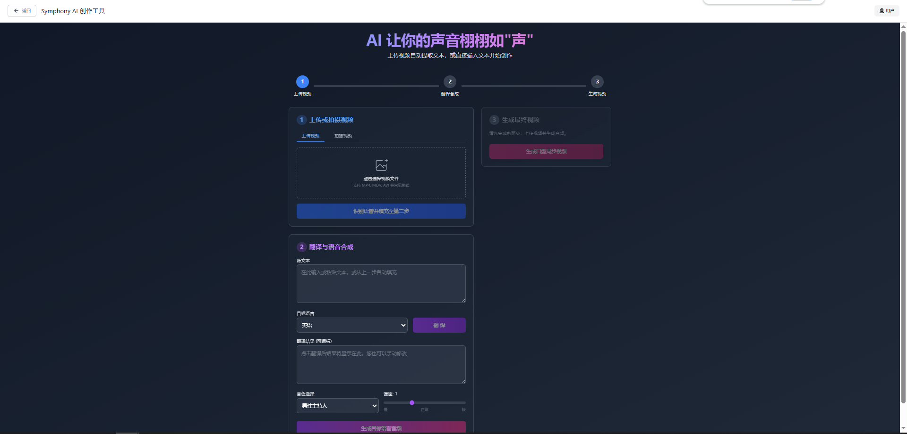

# 🚀 AiCat - 一站式AI工具箱

  
  
  

> 一个集成了多种强大AI能力的现代化网页应用，让你在一个地方就能完成文本生成、代码辅助、图像创作、音视频创作等多种任务。

---

## 📸 项目截图
* 登录界面

* Ai工具主页

* Flux工具界面

* Symphony Ai工具界面

---

## 🛠️ 技术栈

*   **前端**: Vue 3 + TypeScript + Tailwind CSS
*   **后端**: Python (FastAPI)
*   **数据库**: MySQL
*   **AI 服务**: Comfy UI / Minimax API / SiliconCloud